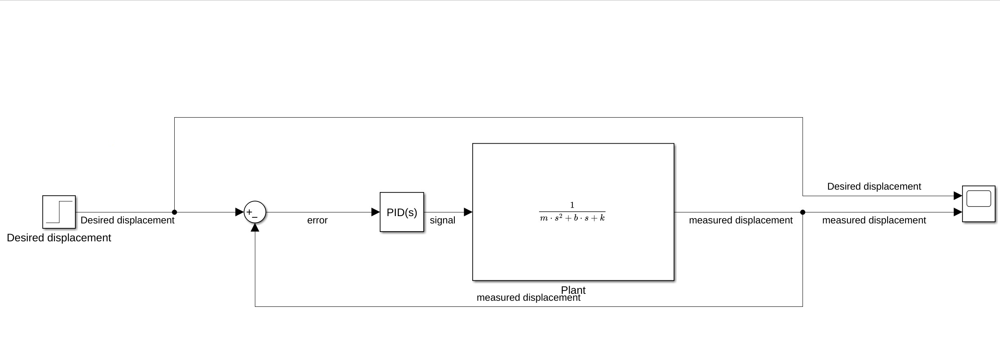
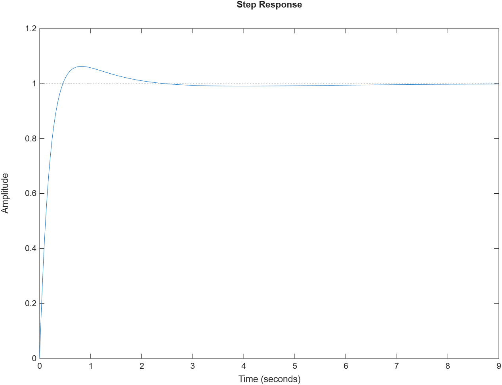
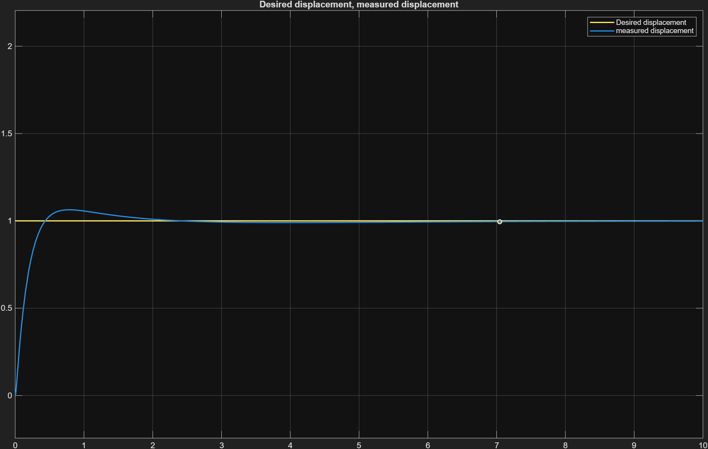

# Mass-Spring-Damper PID Control

MATLAB and Simulink implementation of a PID controller for a mass-spring-damper system. Covers system modeling from Newton's second law, Laplace transform derivation, closed-loop control design, and step response analysis comparing P, PI, and PID controllers.

---

## System Description

A translational mass-spring-damper system where an external force F acts on mass m, opposed by a spring (stiffness k) and a damper (coefficient b).

**Equation of motion (Newton's second law):**

```
F = m·ẍ + b·ẋ + k·x
```

**Transfer function (Laplace domain):**

```
X(s)/F(s) = 1 / (ms² + bs + k)
```

**System parameters used:**

| Parameter | Symbol | Value | Unit |
|-----------|--------|-------|------|
| Mass | m | 1 | kg |
| Damping coefficient | b | 0.5 | Ns/m |
| Spring stiffness | k | 0.25 | N/m |

Substituting: `X(s)/F(s) = 1 / (s² + 0.5s + 0.25)`

---

## Controllers

All three controllers use the same proportional gain Kp for a fair comparison. Ki and Kd are added progressively to show the effect of each term.

| Controller | Kp | Ki | Kd |
|------------|----|----|----|
| P | 6.7193 | 0 | 0 |
| PI | 6.7193 | 1.9761 | 0 |
| PID | 6.7193 | 1.9761 | 5.6799 |

Gains were tuned using the Simulink PID Tuner, then transferred to MATLAB scripts for analysis.

---

## Repository Structure

```
├── Codes/
│   ├── P_controller.m                    # P-only closed-loop step response
│   ├── PI_controller.m                   # PI closed-loop step response
│   ├── PID_controller.m                  # PID closed-loop step response
│   └── PID_controller_simulink.slx       # Simulink block diagram
│
└── Results/
    ├── P_controller_step_response.png
    ├── PI_controller_step_response.png
    ├── PID_controller_step_response.png
    └── PID_controller_simulink_step_response.png
```

---

## Simulink Model

The Simulink block diagram implements a standard unity-feedback closed-loop structure:

```
Desired displacement → [Sum] → [PID(s)] → [Plant: 1/(ms²+bs+k)] → measured displacement
                          ↑                                                 |
                          └─────────────────────────────────────────────────┘
```



---

## Results

### PID Step Response (MATLAB)

The closed-loop system with PID control achieves fast rise, minimal overshoot, and zero steady-state error.



### PID Step Response (Simulink)



### Step Response Data

| Controller | Rise Time | Settling Time | Overshoot |
|------------|-----------|---------------|-----------|
| P | 0.4252 | 15.6146 | 74.1596 |
| PI | 0.4165 | 35.9960 | 83.6537 |
| PID | 0.3042 | 1.7184 | 6.2409 |


---

## How to Run

**MATLAB scripts:**
1. Open MATLAB 2023
2. Run any of `P_controller.m`, `PI_controller.m`, or `PID_controller.m`
3. The step response plot and `stepinfo` metrics will be displayed

**Simulink:**
1. Open `PID_controller_simulink.slx`
2. Set Step block: Final Value = 1, Start Time = 0
3. Click Run — view output on the Scope block

---

## What I Learned

- Deriving a transfer function from a differential equation using the Laplace transform
- Using MATLAB's `tf()`, `pid()`, `feedback()`, and `step()` functions for control system analysis
- Building a closed-loop PID block diagram in Simulink using Transfer Fcn, PID Controller, and Sum blocks
- Effect of each PID term: Kp controls speed of response, Ki eliminates steady-state error, Kd reduces overshoot
- Using Simulink PID Tuner to auto-tune gains, then validating in MATLAB

---

## Tools Used

- MATLAB 2023
- Simulink
- Control System Toolbox